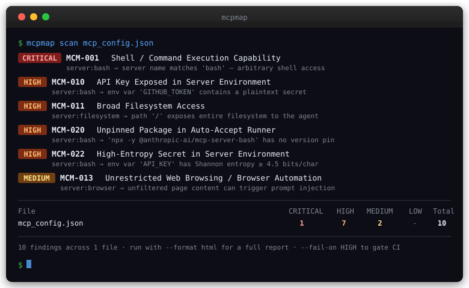

<p align="center">
  
</p>

<h1 align="center">mcpmap</h1>

<p align="center">
  Static attack surface analyzer for MCP servers and LLM tool definitions.
</p>

<p align="center">
  <a href="https://pypi.org/project/mcpmap/"></a>
  <a href="https://pypi.org/project/mcpmap/"></a>
  <a href="https://github.com/bogdanticu88/mcp-map/actions/workflows/ci.yml"></a>
  <a href="https://pypi.org/project/mcpmap/"></a>
  <a href="https://github.com/bogdanticu88/mcp-map/blob/main/LICENSE"></a>
</p>

---

## Why this matters

MCP servers run with the same OS permissions as the user who launched them. When you add a server to your Claude Desktop config, you are granting it the ability to read files, execute commands, call APIs, and send emails — silently, on every session start.

Most people install MCP servers the same way they install browser extensions: quickly, without reviewing what they do. The difference is that an MCP server operates inside your AI agent's context, meaning a single malicious or misconfigured server can:

- **execute shell commands** on your machine via prompt injection
- **read SSH keys, tokens, and credentials** from broad filesystem paths
- **exfiltrate data** through email or HTTP tools triggered by a poisoned prompt
- **persist across sessions** because the config is loaded automatically

mcpmap scans your configuration before any of that can happen. It takes under a second, requires no network access, and maps every finding to [OWASP LLM Top 10](https://genai.owasp.org/) and [MITRE ATLAS](https://atlas.mitre.org/) so you know exactly what class of attack each issue enables.

<p align="center">
  
</p>

---

## Features

- 24 detection rules across CRITICAL / HIGH / MEDIUM / LOW severity
- Supports Claude Desktop `claude_desktop_config.json`, MCP config format, OpenAI tool definitions, and remote HTTP/SSE MCP servers
- **Entropy-based secret detection**: catches hardcoded secrets even when env var names don't look like keys
- **Unpinned package detection**: flags `npx -y @pkg/name` without a version pin
- **Typosquatting detection**: edit-distance comparison against trusted publishers
- **Adversarial instruction detection**: flags prompt-injection patterns embedded in tool descriptions
- **Suppression / allow-list** via `.mcpmap-ignore`: silences known findings without losing other coverage
- **Baseline / diff mode**: `--baseline` shows only what changed since the last scan
- **Context-aware remediation**: advice names the exact path, key, or package to fix
- Output formats: Markdown, JSON, HTML (dark-mode report), SARIF (for GitHub Code Scanning)
- REST API (`mcpmap serve`) for integration with web tooling
- `--fail-on` flag for CI gate enforcement
- Custom rules via `--rules` flag

---

## Installation

```bash
pip install mcpmap
```

Or from source:

```bash
git clone https://github.com/bogdanticu88/mcp-map
cd mcp-map
pip install -e ".[dev]"
```

Works on Windows, macOS, and Linux. Requires Python 3.9+.

Set `NO_COLOR=1` to disable all colour output.

---

## Quick Start

```bash
# Find your Claude Desktop config (cross-platform)
mcpmap find

# Scan a config file
mcpmap scan ~/.config/Claude/claude_desktop_config.json

# Scan a directory for all JSON/YAML configs
mcpmap scan ./configs/

# Show all built-in detection rules
mcpmap rules

# Output an HTML report
mcpmap scan config.json --format html --output report.html

# Fail CI if any HIGH or CRITICAL finding is detected
mcpmap scan config.json --fail-on HIGH

# Show only new findings since the last scan
mcpmap scan config.json --save-baseline baseline.json
mcpmap scan config.json --baseline baseline.json
```

---

## Claude Desktop Config Location

| OS | Default path |
|---|---|
| macOS | `~/Library/Application Support/Claude/claude_desktop_config.json` |
| Windows | `%APPDATA%\Claude\claude_desktop_config.json` |
| Linux | `~/.config/Claude/claude_desktop_config.json` (or `$XDG_CONFIG_HOME/Claude/`) |

Run `mcpmap find` to check all known paths on your current system.

---

## CLI Reference

```
mcpmap [OPTIONS] COMMAND [ARGS]...
```

### `mcpmap scan`

```
mcpmap scan [OPTIONS] TARGETS...
```

TARGETS can be individual files or directories. Directories are walked recursively for `.json`, `.yaml`, and `.yml` files.

| Option | Description |
|---|---|
| `--format`, `-f` | Output format: `markdown` (default), `json`, `html`, `sarif` |
| `--output`, `-o` | Write report to file instead of stdout |
| `--fail-on` | Exit with code 1 if any finding is at or above this severity (`CRITICAL`, `HIGH`, `MEDIUM`, `LOW`) |
| `--summary` | Print terminal summary table only |
| `--ascii` | ASCII-only output (no emoji/badges) |
| `--rules` | Path to custom rules YAML; replaces the built-in rule set |
| `--ignore-file` | Path to a suppression file (default: `.mcpmap-ignore` in target dir or CWD) |
| `--no-ignore` | Disable all suppression file loading |
| `--show-suppressed` | Include suppressed findings in the report |
| `--baseline` | Path to a previous JSON scan result; marks new findings as NEW |
| `--save-baseline` | Save current results as a baseline JSON file |
| `--version`, `-V` | Show version and exit |

### Exit codes

| Code | Meaning |
|---|---|
| `0` | No findings at or above the `--fail-on` threshold (or `--fail-on` not set) |
| `1` | One or more findings at or above the `--fail-on` severity threshold |
| `2` | Invalid `--rules` or `--baseline` path, target not found, or output file not writable |

### `mcpmap rules`

```
mcpmap rules [--rules PATH]
```

Lists all detection rules in a table (ID, severity, category, name). Pass `--rules` to preview a custom rules file before using it in a scan.

### `mcpmap find`

```
mcpmap find
```

Detects your OS and lists known Claude Desktop config locations, indicating which exist. Prints a ready-to-paste `mcpmap scan` command for found files.

### `mcpmap serve`

```
mcpmap serve [OPTIONS]
```

| Option | Description |
|---|---|
| `--host` | Bind host (default: `127.0.0.1`) |
| `--port`, `-p` | Bind port, 1-65535 (default: `8000`) |
| `--rules` | Path to custom rules YAML |

---

## Suppression / Allow-list

Create a `.mcpmap-ignore` file in your project root or next to the config file:

```
# Suppress this rule everywhere
MCM-014

# Suppress only for the named server
MCM-010:my-internal-server

# Suppress all findings for a server you've audited
*:legacy-mcp-server
```

Format per line: `RULE_ID` or `RULE_ID:server_name` or `*:server_name`. Lines starting with `#` are comments.

mcpmap looks for `.mcpmap-ignore` adjacent to the first scan target, then in the current working directory. Override with `--ignore-file PATH` or disable entirely with `--no-ignore`.

```bash
# Scan with a custom suppression file
mcpmap scan config.json --ignore-file security/approved.ignore

# Show suppressed findings alongside active ones
mcpmap scan config.json --show-suppressed
```

---

## Baseline / Diff Mode

Track what changes between scans. Useful in CI to alert only on regressions.

```bash
# Step 1: save the current findings as a baseline
mcpmap scan config.json --save-baseline baseline.json

# Step 2 (later, in CI): compare against it
mcpmap scan config.json --baseline baseline.json
```

Each finding in the output is labelled:

- **NEW**: finding did not exist in the baseline
- **Resolved**: finding was in the baseline but is no longer detected
- **Unchanged**: present in both (hidden from the diff summary)

Combine with `--fail-on` to fail CI only when new findings are introduced:

```bash
mcpmap scan config.json --baseline baseline.json --fail-on HIGH
```

---

## REST API

Start the server:

```bash
mcpmap serve
```

### `POST /analyze`

Analyze a config payload.

```bash
curl -s http://localhost:8000/analyze \
  -H "Content-Type: application/json" \
  -d '{
    "content": {
      "mcpServers": {
        "bash": {
          "command": "npx",
          "args": ["-y", "@anthropic-ai/mcp-server-bash"],
          "env": {"API_KEY": "sk-..."}
        }
      }
    },
    "filename": "config.json",
    "format": "json"
  }'
```

**Request fields:**

| Field | Type | Description |
|---|---|---|
| `content` | object | The config to analyze |
| `filename` | string | Hint for format detection (default: `config.json`) |
| `format` | string | Report format in `report` field: `json`, `markdown`, `html`, `sarif` |
| `fail_on` | string | Optional severity threshold; sets `failed: true` in response |

**Response:**

```json
{
  "results": [...],
  "summary": {"CRITICAL": 2, "HIGH": 1, "MEDIUM": 0, "LOW": 0, "TOTAL": 3},
  "failed": true,
  "report": "..."
}
```

### `GET /rules`

List all loaded rules with severity, category, and framework mappings.

### `GET /health`

Returns `{"status": "ok", "version": "..."}`.

---

## Supported Input Formats

### MCP Config (`claude_desktop_config.json`)

Local process-based server:

```json
{
  "mcpServers": {
    "filesystem": {
      "command": "npx",
      "args": ["-y", "@modelcontextprotocol/server-filesystem@1.2.3", "/home/user/projects"],
      "env": {}
    }
  }
}
```

Remote HTTP/SSE server (also scanned):

```json
{
  "mcpServers": {
    "remote-assistant": {
      "url": "https://mcp.example.com/sse",
      "headers": {"Authorization": "Bearer sk-..."}
    }
  }
}
```

### OpenAI Tool Definitions

```json
{
  "tools": [
    {
      "type": "function",
      "function": {
        "name": "run_bash",
        "description": "Execute a bash command",
        "parameters": {
          "type": "object",
          "properties": {"command": {"type": "string"}}
        }
      }
    }
  ]
}
```

---

## Rule Set

### CRITICAL

| ID | Name | Category |
|---|---|---|
| MCM-001 | Shell / Command Execution Capability | Excessive Agency |
| MCM-002 | Arbitrary Code Execution Capability | Excessive Agency |
| MCM-003 | Credential and Secret Store Access | Sensitive Data Exposure |
| MCM-004 | Process Management Capability | Excessive Agency |

### HIGH

| ID | Name | Category |
|---|---|---|
| MCM-005 | Filesystem Write Access | Excessive Agency |
| MCM-006 | Unrestricted Network Fetch / HTTP Request | Data Exfiltration |
| MCM-007 | Email Send Capability | Data Exfiltration |
| MCM-008 | Git Write / Repository Push Access | Supply Chain |
| MCM-009 | Database Write / Delete Access | Excessive Agency |
| MCM-010 | API Key or Token Exposed in Server Environment | Sensitive Data Exposure |
| MCM-011 | Broad Filesystem Access (Root or Home Directory) | Sensitive Data Exposure |
| MCM-012 | Overprivileged MCP Server | Excessive Agency |
| MCM-020 | Unpinned Package Version in Auto-Accept Runner | Supply Chain |
| MCM-021 | Adversarial Instructions Embedded in Tool Description | Prompt Injection Risk |
| MCM-022 | High-Entropy Secret in Server Environment | Sensitive Data Exposure |
| MCM-024 | Package Name Resembles Trusted Publisher (Typosquatting) | Supply Chain |

### MEDIUM

| ID | Name | Category |
|---|---|---|
| MCM-013 | Unrestricted Web Browsing / Browser Automation | Prompt Injection Risk |
| MCM-014 | Unverified Third-Party MCP Server | Supply Chain |
| MCM-015 | Tool Missing Description (Tool Confusion Risk) | Tool Confusion |
| MCM-016 | Sensitive Directory Read Access | Sensitive Data Exposure |
| MCM-023 | Remote MCP Server over HTTP/SSE | Supply Chain |

### LOW

| ID | Name | Category |
|---|---|---|
| MCM-017 | Calendar Write Access | Data Exfiltration |
| MCM-018 | Social Media Post Capability | Data Exfiltration |
| MCM-019 | Push Notification Send Capability | Data Exfiltration |

Each finding includes:
- OWASP LLM Top 10 reference(s)
- MITRE ATLAS technique reference(s)
- Context-aware remediation guidance (names the exact path, key, or package to fix)
- Evidence string (what matched and where)

### Detection techniques

| Rule | Detection method |
|---|---|
| MCM-001 to MCM-019 | Pattern matching on server names, package names, tool names, descriptions, env keys, and filesystem paths |
| MCM-020 | Detects `npx`/`uvx`/`bunx` with `-y`/`--yes` and no version-pinned package arg |
| MCM-021 | Matches 20+ known prompt-injection phrase patterns in tool descriptions |
| MCM-022 | Shannon entropy >= 4.5 bits/char on env variable values >= 20 chars (with URL/path exclusions) |
| MCM-023 | Detects servers configured with a `url` field instead of a local `command` |
| MCM-024 | Levenshtein distance <= 2 between package scope and trusted publisher names |

---

## Custom Rules

Extend or replace the built-in rules with your own YAML file:

```yaml
rules:
  - id: CUSTOM-001
    name: My Custom Rule
    description: Detects a dangerous pattern specific to our environment.
    severity: HIGH
    category: Excessive Agency
    owasp_llm:
      - id: LLM06
        name: "Excessive Agency"
        url: "https://genai.owasp.org/llmrisk/llm06-excessive-agency/"
    mitre_atlas:
      - id: AML.T0051.001
        name: "LLM Prompt Injection: Indirect"
        url: "https://atlas.mitre.org/techniques/AML.T0051.001"
    remediation: Remove or gate this tool behind human confirmation.
    detection:
      tool_name_patterns:
        - my_dangerous_tool
      tool_description_keywords:
        - dangerous operation
```

```bash
mcpmap scan config.json --rules my_rules.yaml

# Preview which rules would be loaded
mcpmap rules --rules my_rules.yaml
```

### Detection fields

| Field | Type | Description |
|---|---|---|
| `server_name_patterns` | list[str] | Substring match on server name |
| `package_patterns` | list[str] | Substring match on package name |
| `broad_path_patterns` | list[str] | Exact or subdirectory-prefix match on args |
| `sensitive_path_patterns` | list[str] | Substring match on args |
| `env_key_patterns` | list[str] | Substring match on env variable keys |
| `env_value_entropy_threshold` | float | Flag env values with Shannon entropy above this level |
| `env_value_min_length` | int | Minimum value length for entropy check (default: 20) |
| `tool_name_patterns` | list[str] | Substring match on tool name |
| `tool_description_keywords` | list[str] | Substring match on tool description |
| `description_injection_patterns` | list[str] | Adversarial phrases to detect in tool descriptions |
| `parameter_names` | list[str] | Substring match on tool parameter names |
| `check_empty_description` | bool | Flag tools with no description |
| `check_unpinned_package` | bool | Flag auto-accept runners without a version pin |
| `check_remote_server` | bool | Flag servers configured with a `url` field |
| `check_typosquatting` | bool | Enable edit-distance check against trusted publishers |
| `typosquatting_distance` | int | Maximum edit distance to flag (default: 2) |
| `trusted_package_prefixes` | list[str] | Trusted publisher prefixes for supply chain checks |
| `high_risk_tool_threshold` | int | Number of high-risk findings to trigger MCM-012 |

---

## CI/CD Integration

### GitHub Actions

```yaml
- name: Scan MCP config
  run: |
    pip install mcpmap
    mcpmap scan claude_desktop_config.json --fail-on HIGH --format sarif --output mcpmap.sarif

- name: Upload SARIF to Code Scanning
  uses: github/codeql-action/upload-sarif@v3
  with:
    sarif_file: mcpmap.sarif
```

With baseline diff to fail only on new regressions:

```yaml
- name: Restore baseline
  uses: actions/cache@v4
  with:
    path: mcpmap-baseline.json
    key: mcpmap-baseline-${{ github.base_ref }}

- name: Scan MCP config
  run: |
    pip install mcpmap
    mcpmap scan config.json \
      --baseline mcpmap-baseline.json \
      --save-baseline mcpmap-baseline.json \
      --fail-on HIGH

- name: Save updated baseline
  uses: actions/cache@v4
  with:
    path: mcpmap-baseline.json
    key: mcpmap-baseline-${{ github.ref_name }}
```

### Pre-commit Hook

```yaml
repos:
  - repo: local
    hooks:
      - id: mcpmap
        name: mcpmap MCP security scan
        entry: mcpmap scan
        args: ["--fail-on", "CRITICAL"]
        language: python
        files: "claude_desktop_config\\.json|mcp.*\\.json"
```

---

## Docker

```bash
docker build -t mcpmap .
docker run --rm -v $(pwd):/work mcpmap scan /work/config.json
```

---

## Development

```bash
pip install -e ".[dev]"
pytest
ruff check mcpmap/
```

You can also invoke the CLI as a module:

```bash
python -m mcpmap scan config.json
python -m mcpmap find
python -m mcpmap rules
```

---

## Security Framework Mapping

mcpmap findings map to:

- **[OWASP LLM Top 10](https://genai.owasp.org/)**: LLM01 Prompt Injection, LLM02 Sensitive Information Disclosure, LLM03 Supply Chain, LLM06 Excessive Agency
- **[MITRE ATLAS](https://atlas.mitre.org/)**: AML.T0051.000 (Direct Prompt Injection), AML.T0051.001 (Indirect Prompt Injection), AML.T0054 (LLM Jailbreak), AML.T0048 (Societal Harm)

---

## Limitations

mcpmap is a static analyzer. It reads configuration files without executing any code or making network requests.

- It cannot detect runtime misconfigurations or vulnerabilities introduced after the agent starts.
- Entropy-based secret detection (MCM-022) may produce false positives on long random-looking values (e.g., base64-encoded certificates, concatenated UUIDs). Use `.mcpmap-ignore` to suppress confirmed non-secrets.
- Typosquatting detection (MCM-024) compares the package scope against a built-in list of trusted publishers. Publishers not in that list are not checked.
- Pattern matching rules (MCM-001 to MCM-019) look for known-dangerous names and capabilities. Novel tools with custom names that wrap dangerous operations are not detected unless they match a known pattern or custom rule.
- mcpmap does not perform sandbox execution, import analysis, or dynamic taint analysis.

---

## License

MIT. See [LICENSE](LICENSE).
